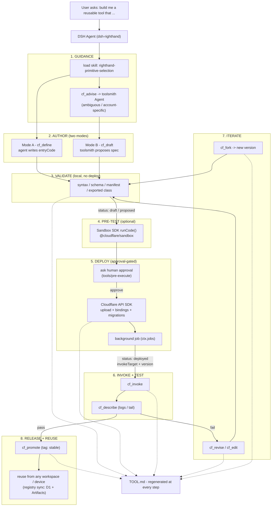
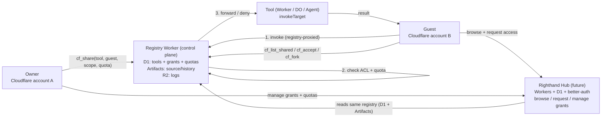

# dsh-righthand — diagrams

Rendered with Mermaid. View in any markdown preview that supports Mermaid (GitHub, VS Code with extension, Obsidian, etc.).

## 1. Tool-building workflow

## 2. Sharing tools with other users (future)

## Legend

- **Solid arrows** = the agent's ordered workflow / control flow.
- **Dashed arrows** = side effects (documentation updates).
- The **TOOL.md** node shows that every step synchronously regenerates the tool's self-documentation (see RESEARCH.md §20).
- In the sharing diagram, all invocation is **registry-proxied** in v1 so ACL + per-grantee quota checks happen at a single choke point (see RESEARCH.md §22).
